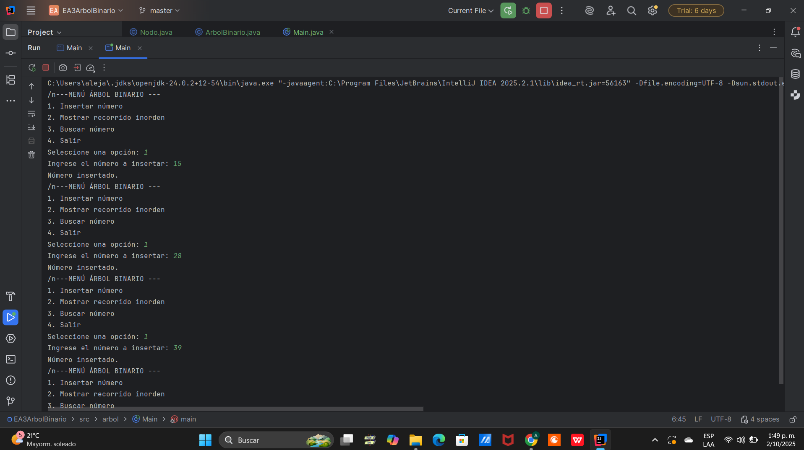
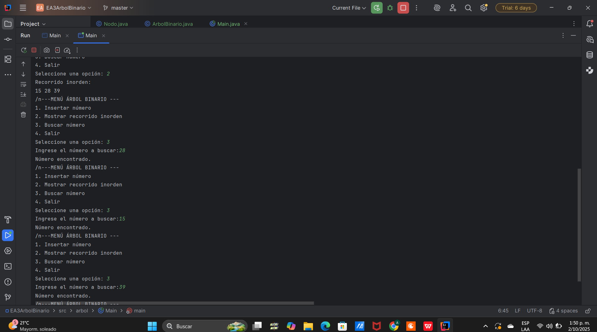
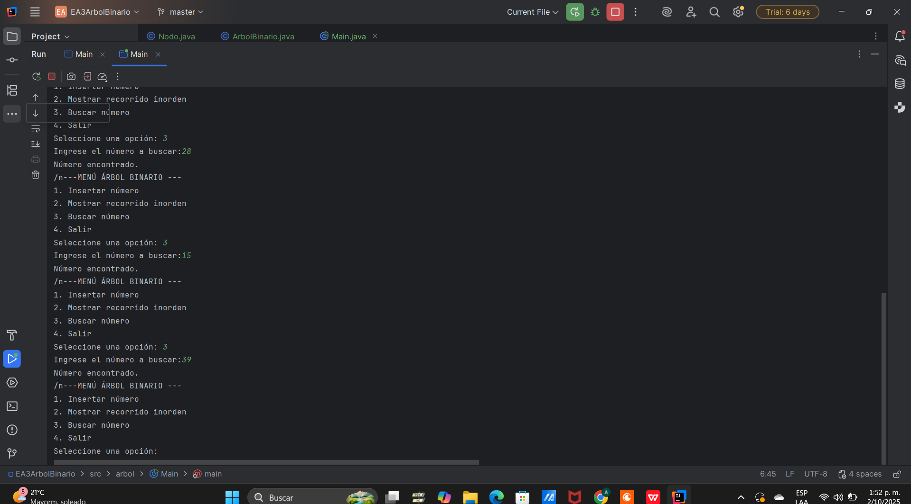

# EA3 - Árbol Binario en Java

## Descripción del proyecto

Este proyecto implementa un árbol binario simple en Java, permitiendo insertar, recorrer y buscar números. Fue desarrollado como parte de la actividad EA3 para comprender el funcionamiento de los árboles binarios y fortalecer habilidades en estructuras de datos, programación y documentación técnica.

----

## ¿Qué es un árbol binario?

Un árbol binario es una estructura jerárquica donde cada nodo tiene como máximo dos hijos: izquierdo y derecho. Se utiliza para organizar datos de forma eficiente, facilitando operaciones como búsqueda, inserción y recorrido.

---

## Recorrido inorden

El recorrido inorden visita primero el subárbol izquierdo, luego la raíz y finalmente el subárbol derecho. Esto permite mostrar los datos en orden ascendente.

---

**Ejemplo:**  
Si insertamos los números `25, 39, 15, 2, 20`, el recorrido inorden mostrará:  
`2 → 15 → 20 → 25 → 39`


## Ejecución en consola

## Menú principal

```text
--- MENÚ ÁRBOL BINARIO ---
1. Insertar número
2. Mostrar recorrido inorden
3. Buscar número
4. Salir

----

 ## Inserción de números  


 ## Recorrido inorden  


 ## Búsqueda de número  



